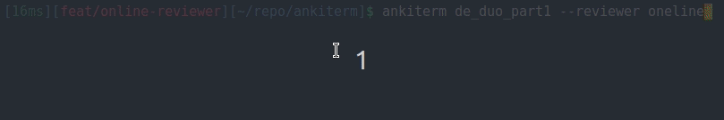

# Ankiterm

Ankiterm is a cli anki review tool.

## Table of Contents

- [Demo](#demo)
- [Installation](#installation)
- [Usage](#usage)
- [Contributing](#contributing)
- [License](#license)

## Demo



## Installation

To install AnkiTerm, follow these steps:

1. Clone the repository: `git clone https://github.com/pluveto/ankiterm.git`
2. Navigate to the project directory: `cd ankiterm`
3. Build the executable: `make`
4. Install AnkiTerm: `make install` (`INSTALL_DIR` can be specified, default is `/usr/local/bin`)

## Usage

AnkiTerm can be used as follows:

```shell
ankiterm "Deck Name"
```

Options:

- `-r, --reviewer`: Reviewer name. Different reviewer will provide different review interaction strategy.
  - `stream`: The default reviewer. History cards will apprear in a operation stream.
  - `oneline`: Cards will apprear in a single line.

Examples:

```shell
ankiterm vocabs -r oneline
```

## Contributing

Contributions are welcome! Here's how you can contribute to the project:

1. Fork the repository.
2. Create a new branch: `git checkout -b feature/your-feature-name`
3. Make your changes and commit them: `git commit -am 'feat: add some feature'`
4. Push the branch to your forked repository: `git push origin feature/your-feature-name`
5. Open a pull request.

Please ensure that your code follows the project's coding style and includes appropriate tests.

## License

This project is licensed under the MIT License. See the [LICENSE](LICENSE) file for details.
